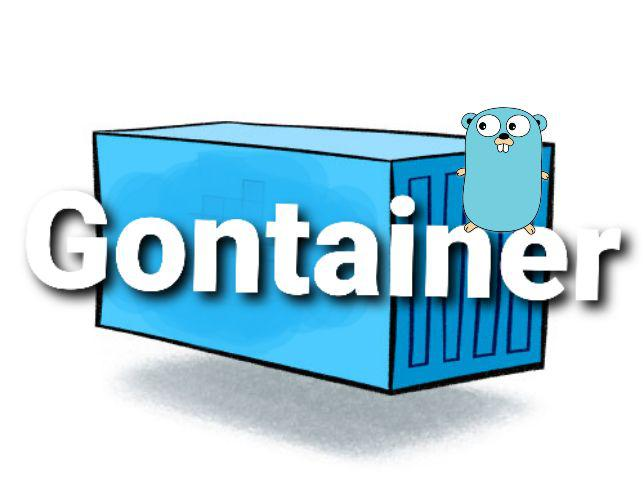

# Gontainer



**Gontainer** is a container made for fun and curiosity.

The scope of this project was to better understand Linux namespacing, and apply it to create a rudimental container.


## Install

If you have a [Go](https://golang.org/) environment ready to go, it's as easy as:

```bash
go get github.com/alegrey91/Gontainer
```

Once you retrieved you are ready to build:

```bash
go build github.com/alegrey91/Gontainer
```


## Usage

Typing `Gontainer -h` the following output will be shown:

```
Usage: ./Gontainer -run -uid [-mnt=/path/rootfs] [-uts [-hostname=new_hostname]] [-ipc] [-net] [-pid]
  -mnt='/path/rootfs'           Enable Mount namespace
  -uts                          Enable UTS namespace
  -hostname='new_hostname'      Set a custom hostname into the container
  -ipc                          Enable IPC namespace
  -net                          Enable Network namespace
  -pid                          Enable PID namespace
  -uid                          Enable User namespace
  -v                            Check Gontainer version
```

Below there is a full explanation of provided arguments:

* **mnt**: Mount namespaces control mount points. Upon creation the mounts from the current mount namespace are copied to the new namespace. The clone flag used to create a new namespace of this type is CLONE_NEWNS. [6]
* **uts**: UTS namespaces allow a single system to appear to have different host and domain names to different processes. The clone flag used to create a new namespace of this type is CLONE_NEWUTS. [6]
* **ipc**: IPC namespaces isolate processes from SysV style inter-process communication. This prevents processes in different IPC namespaces from using, for  example, the SHM family of functions to establish a range of shared  memory between the two processes. The clone flag used to create a new namespace of this type is CLONE_NEWIPC. [6]
* **net**: Network namespaces virtualize the network stack. On creation a network namespace contains only a loopback interface. The clone flag used to create a new namespace of this type is CLONE_NEWNET. [6]
* **pid**: The PID namespace provides processes with an independent set of process IDs (PIDs) from other namespaces. The first process created in a PID namespace is assigned the process id  number 1 and receives most of the same special treatment as the normal  init process. The clone flag used to create a new namespace of this type is CLONE_NEWPID. [6]
* **uid**: User namespaces are a feature to provide both privilege isolation and  user identification segregation across multiple sets of processes  available since kernel 3.8. With administrative assistance it is possible to build a container with  seeming administrative rights without actually giving elevated  privileges to user processes. The clone flag used to create a new namespace of this type is CLONE_NEWUSER. [6]


## Examples

If you are interested in understanding how a containerized process is isolated from the rest of the system, follow the next step.

### User ID isolation

From your terminal run:

```Gontainer -run -uid```

The result will be:

```
[user@real-hostname ~]$ ./Gontainer -run -uid
[Gontainer config]
• mnt:  ""
• uts:  disabled
• ipc:  disabled
• net:  disabled
• uid:  enabled

📦 [root@real-hostname] ~/home/user ‣  
```

What's happened? 

We are trying to running `Gontainer` from the home directory of a non privileged user (`user`).

Using the flag option `-uid` we are mapping our local UID with the container's `root` UID.

For this reason, we are `root` inside the container. First magic of Linux namespaces!

### Mount isolation

Commonly called as `chroot` this represents the true essence of the system isolation.

First of all, we need a basic root filesystem. If you have docker installed, you can retrieve a rootfs from it:

`docker container inspect alpine | grep UpperDir`

Just `cp -r` the resultant path to `/tmp/rootfs` and then:

`Gontainer -run -uid -mnt /tmp/rootfs`

As you can see, your OS file system has disappeared, leaving space for a new file system (the alpine fs).


## References

1. https://medium.com/@teddyking/linux-namespaces-850489d3ccf
2. https://medium.com/@ssttehrani/containers-from-scratch-with-golang-5276576f9909
3. http://ifeanyi.co/posts/linux-namespaces-part-1/
4. https://klotzandrew.com/blog/container-from-scratch
5. https://www.infoq.com/articles/build-a-container-golang/
6. https://en.wikipedia.org/wiki/Linux_namespaces

